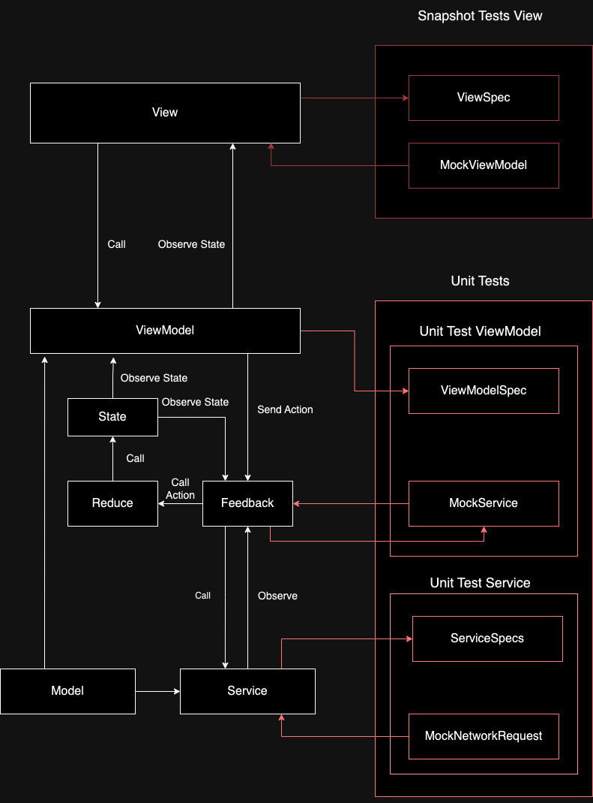

# "Swift Development Best Practices Demo - SOLID, DI, Reactive Programming, Testing, and Beyond" - 93%! code coverage

## This project is not over-engineered or excessive in its complexity. Rather, it is intended to showcase my skills to potential employers or clients in writing high-quality code and implementing advanced solutions that can be used in larger projects. However, before using these solutions in a larger project, it is important to experiment with them on a smaller, standalone project to ensure their effectiveness and suitability.

## While it's important to showcase our skills and demonstrate our ability to implement advanced solutions, it's also crucial to find a balance between complexity and practicality in real-world projects. Ultimately, we need to adhere to the requirements and guidelines set by the organization and ensure that our code is maintainable, scalable, and efficient. Additionally, we need to consider the team dynamics and ensure that our code is easy to understand, modify, and maintain by other team members. By finding this balance, we can create high-quality code that meets the needs of the project, the organization, and the team.

## Installation

### To run the project after downloading it, open the .xcodeproj file in Xcode, choose the FeedReader-Debug scheme, select a simulator or connected device, and click the "Run" button or press Command + R.

### This standalone project has been confirmed to be working on Xcode 15.0.1 and simulators for the following devices: iPhone 15 Pro and iPhone 15 Pro Max, running iOS 17.0.1 The project has also been tested on a real device, iPhone 11 Pro Max, running iOS 16.1.1.

## Running Unit Tests

1. Open your `.xcodeproj` file with Xcode.
2. Select the `FeedReader-Debug` scheme.
3. Press `Command + 6` or click on the `Test navigator` icon to view all test cases.
4. Run all unit tests by selecting `Product` > `Test` from the menu bar or by pressing `Command + U`.
5. To run a specific test, click the play button next to the test name in the test navigator.

## Running Snapshot Tests

1. Select the appropriate simulator for the snapshot tests, such as the iPhone 15 Pro.
2. Select the `FeedReader-Debug` scheme.
3. Press `Command + 6` or click on the `Test navigator` icon to view all test cases and locate the snapshot tests in `FeedReaderSnapshotTests`
4. Click the play button next to the snapshot test to run it individually, or run all tests with `Command + U`.
5. To run a specific test, click the play button next to the test name in the test navigator.
6. To see generated images navigate to to the project directory in Finder and open directory `FeedReaderSnapshotTests/__Snapshots__`. Generated file names match filename and test descriptions. `{filename}-{describe}-{context}-{it}`

## Troubleshooting Snapshot Access Errors

### If you encounter access errors when trying to access snapshot images in your iOS project, you may need to delete the snapshot folder and regenerate the snapshots. Here are the steps to do this:

1. Close Xcode and any other applications that may be accessing the snapshot folder.
2. Open Finder and navigate to the project directory.
3. Locate the __Snapshots__ folder in the FeedReader/FeedReaderTests/SnapshotViewSpec subdirectory and delete it.
4. Open Xcode and rebuild the project.
5. To re-run the tests that use snapshot images, you can choose "Test" from the "Product" menu in Xcode or press Command + U. This will rebuild the project and run all the tests, including the ones that use snapshot images.

If you still encounter access errors after deleting the snapshot folder, you may need to check the file permissions for the snapshot folder and ensure that you have read and write access to it. You can also try resetting the simulator or cleaning the build folder in Xcode.

## Project Schemes

The project includes different schemes for various purposes. Here's a brief description of each:

### `FeedReader-Release`
This is the release scheme intended for production. It is configured with optimizations for performance and is used for deploying the app to the App Store or other distribution methods.

- Optimizations: Enabled
- Debugging: Disabled
- Configuration: Release

### `FeedReader-Debug`
The debug scheme is meant for development and testing. It includes debugging symbols and is configured without optimizations to facilitate stepping through code and diagnosing issues.

- Optimizations: Disabled
- Debugging: Enabled
- Configuration: Debug
- Additional: Unit Tests and Snapshot Tests are available and can be run through this scheme.

### `FeedReader-Mock`
This scheme is set up to use mock data and services for testing purposes. It is useful when the development or testing does not require real API calls, or when the API is unavailable or unreliable.

- API Endpoints: Mock Services
- Configuration: Debug
- Additional: Ideal for offline development or continuous integration setups where tests need to run without external dependencies.

Each scheme is tailored for specific development and deployment scenarios, so make sure to select the appropriate one based on your current task.

## Technical Features

1. Follows SOLID principles
2. Uses MVVM architecture
3. Achieves a code coverage of 93%
4. Implement functionality to cancel the download of images and feeds when the back button is tapped.
5. Implement the dark theme 
6. Includes snapshot tests and unit tests
7. Implements error handling
8. Uses dependency injection with the @Injected wrapper for easier finding
9. Registers dependencies in a separate file for better organization and maintainability
10. Follows the feedback pattern with the Loadable protocol
11. Uses the state pattern and reducers
12. Uses reactive programming
13. Follows the Quick and Nimble format for unit and snapshot tests, similar to Jasmine format
14. Names snapshot image files the same as the test descriptions
15. Separates styles from views for better maintainability and reusability
16. Includes a separate scheme (FeedReader-Mock) for mocking the project
17. Merges previews with snapshot tests to keep the same code for both
18. Implements request caching for improved performance
19. Implements image caching for faster image loading and improved user experience
20. Uses generics for type safety and code reuse
21. Used swiftlint in vscode IDE to perform code formatting
22. Uses sonarqube for code quality analysis

**View:** SwiftUI views like `MoviesListView` and `MovieDetailView` that display UI and react to state changes.  

**ViewModel:** Mediate between the Views and Models by managing UI state, transforming data, and handling view logic specific to each screen.  

**State:** State enums defined in ViewModels that represent different UI states like `.loaded`, `.loading`, etc.  

**Reduce:** Reduce functions in ViewModels that handle state transitions based on actions.  

**Feedback:** Protocols like `LoadableProtocol` that enable ViewModels to provide feedback on state changes.  

**Service:** Services like `MovieService` that encapsulate backend API logic and networking.  

**Model:** Model objects like `Movie` that represent domain data.  

## Optimisation

- **Image Caching:** An image cache is used to store downloaded images in memory, avoiding duplicate network requests and providing a smoother user experience. The most recently used images are kept in the cache while older images are evicted as needed.

- **Request caching:** API requests are cached to avoid duplicate requests. The cache policy can be configured based on requirements. This improves performance and reduces network usage.

- **Back button pressed cancelation** When the user presses the back button, the download of images and feeds is cancelled.

- **One instance view** Views are singletons to avoid creating multiple instances of the same view and call unnecessary requests.

- **Reactive Programming** The reactive programming with Combine framework is tightly integrated to update the UI in response to data changes, further simplifying the codebase and performance.

[See more with code examples ...](Documentation/Optimisation.md)

## Patterns
[MVVM State](Documentation/MVVMState.md)  
[FeedBack System](Documentation/FeedbackSystem.md)  
[Jasmin](Documentation/Jasmin.md)  
[Dependency Injection](Documentation/DependencyInjection.md)  
[Visual Regression Testing](Documentation/VisualRegressionTesting.md)  
[Any Protocol](Documentation/AnyProtocol.md)  
[Factory Instance](Documentation/FactoryInstance.md)  

## 3rd party Libraries

Nimble 13.0.0  
Quick 7.3.0  
Swinject 2.8.4  
swift-snapshot-testing 1.15.0  
Nimble-snapshot-testing 4.0.3  
swiftui-preview-snapshots 1.1.0   

## Sources
https://www.swiftbysundell.com/articles/encapsulating-swiftui-view-styles/  
https://www.vadimbulavin.com/modern-mvvm-ios-app-architecture-with-combine-and-swiftui/  
https://github.com/hmlongco/Resolver  
https://github.com/Swinject/Swinject  
https://github.com/Quick/Quick  
https://github.com/Quick/Nimble  
https://www.browserstack.com/guide/snapshot-testing-ios  
https://github.com/pointfreeco/swift-snapshot-testing  
https://github.com/tahirmt/Nimble-SnapshotTesting/  
https://swiftpackageindex.com/doordash-oss/swiftui-preview-snapshots  
https://blog.devgenius.io/unit-test-networking-code-in-swift-without-making-loads-of-mock-classes-74489d0b12a8  
